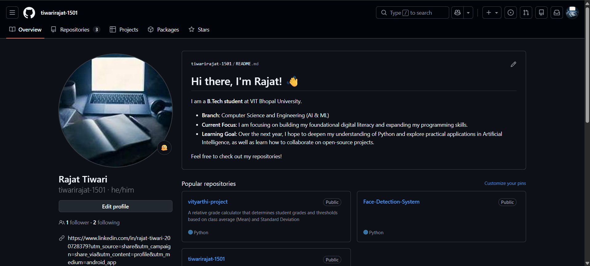
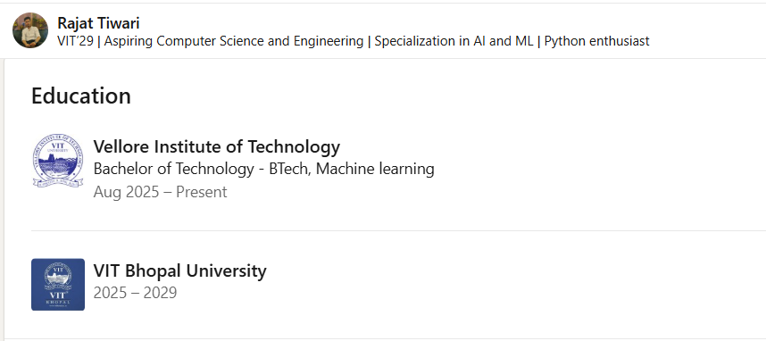
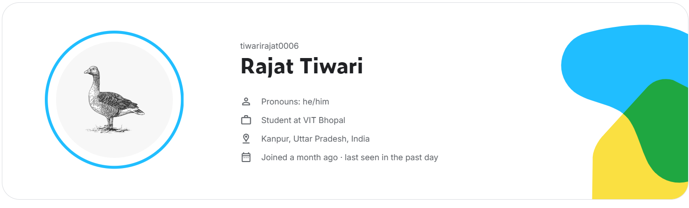

# Student Digital Portfolio

Welcome to my digital portfolio setup for the CSE0001 Digital Literacy course. Below are the foundational professional profiles I have established across three key platforms to build my online presence.

---

## 1. GitHub
**Platform Purpose:** GitHub is an essential developer platform used for version control, hosting code, and collaborative software development. 

**My Strategy:** I plan to use GitHub as my primary technical portfolio. Over the next four years, I will use it to host my Python scripts, showcase my Artificial Intelligence (AI) and Machine Learning (ML) projects, and learn how to collaborate on open-source software.

---

## 2. LinkedIn
**Platform Purpose:** LinkedIn is the premier professional networking platform used for career development, building industry connections, and job searching.

**My Strategy:** I have established my educational background here to build credibility. I plan to use LinkedIn to connect with VIT Bhopal alumni, follow industry leaders in the tech space, and actively search for summer internships as I progress through my B.Tech degree.

---

## 3. Kaggle
**Platform Purpose:** Kaggle is a specialized online community for data scientists and machine learning practitioners, offering massive datasets, collaborative notebooks, and skill-building competitions.

**My Strategy:** As an AI enthusiast, Kaggle will be my main practice ground. I intend to use this platform to access real-world datasets, practice building predictive models, and participate in beginner-friendly machine learning competitions to sharpen my practical skills.

